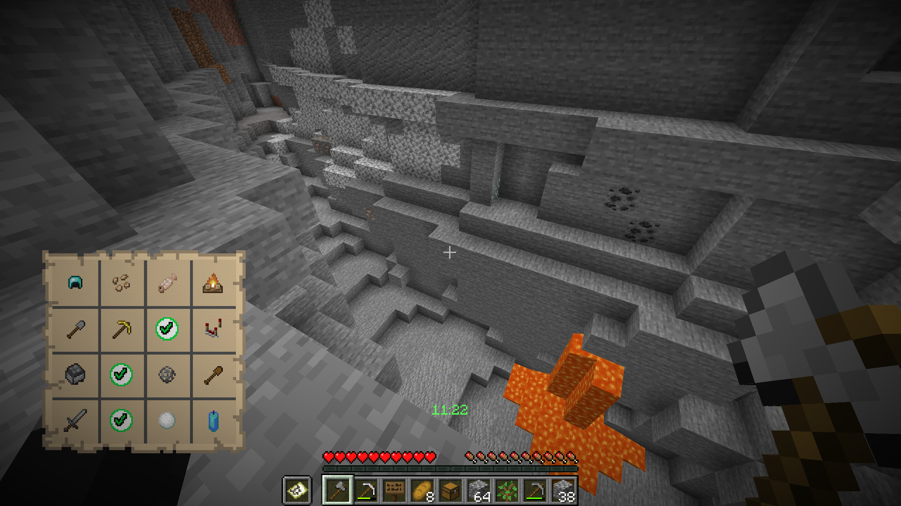

# Bingo

---

### The first one to find 4 items in a line wins  
### A simple Bingo Plugin for Spigot 1.18.1

## Preview

## Commands
#### /board - Prints out the Bingo Board to the chat
#### /reroll - Rerolls all items on the Board
#### /forcestart - Skips the Cooldown before the game
#### /backpack - Opens the Team Backpack
#### /teamchat - Lets you chat with your Teammates

## Building Locally
#### To build this Project on your local machine you need to have [maven](https://maven.apache.org/download.cgi) installed and added to your PATH
1. Clone the Repository:

        git clone https://github.com/Duckulus/Bingo
2. Move to the project directory:

        cd Bingo
3. Build the Project using maven

        mvn clean package

#### This Puts the plugin jar into the ./target directory inside of the project

## l10n
This Plugin features a Localization System which allows you to edit the game messages based on the users client language.
To do so go into the localization folder inside the Plugins data directory (`server/plugins/Bingo/localization`) and edit the files.
To add your own language you have to look up its [Language Code](https://minecraft-archive.fandom.com/wiki/Languages). 
Inside the Localization Directory create a file called
`[code].yml` and copy the contents of `en_us.yml`. Now you can translate it into your own language.

Contributions to the Plugins Native Languages(Currently only English and German) are also welcome.
To Contribute, fork the project and add your language files [here](src/main/resources/localization)
and follow the procedure described above.
After that you can open a Pull request.

## Other Information

#### Inspired by: [HGLabor Bingo](https://github.com/HGLabor/Bingo)

#### Download: [SpigotMC](https://www.spigotmc.org/resources/bingo.98825/)
        

